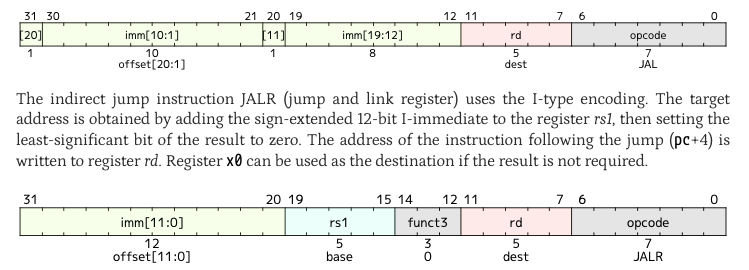
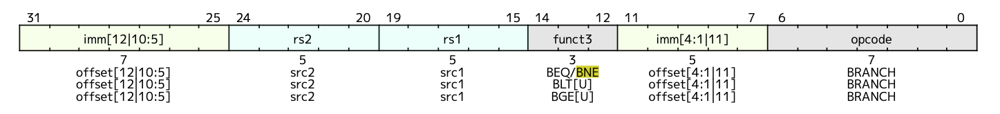

# RISC-V Processor Design 🚀

## Building Tiny Vedas

Marco Spaziani Brunella, PhD
Lecture 10

---

# Agenda

- Branches
- Pipeline Flushing
- Branch Penalty

---

# Branches

- Instructions used to implement conditional code execution: if, else, while, for, etc.
- Branches can be unconditional or conditional

---

# Unconditional Branches in RISC-V

- JAL and JALR operation, they involve also a reg file side effect generation
   - JAL -> pc += sext(offset), rd = pc + 4
   - JALR -> rd = pc + 4, pc = rs1 + sext(offset)

---

# Conditional Branches in RISC-V

- BEQ, BNE, BLT, BGE, BLTU, BGEU
- All of them follow the same pattern:
  - pc += sext(offset) if cond is true
  - pc += 4 if cond is false

---

# Implementing Branching in the Pipeline

- We fetch instructions sequentially by default --> Assume the branch is never taken
- Whenever we change the pc, it means that the instructions we fetched are now invalid
- We need to flush the pipeline: get rid of the instructions we fetched and get new ones

---

# Branch Penalty

- Once we take a branch and flush the pipeline, we need to wait for the pipeline to be filled again
- We thus incur a penalty in taking a branch, as every time we take a branch we need to fill again the pipeline
- The branch penalty, measured in clock cycles, is the same as the pipeline stages

---

# Improvements (not covered in this course) 

- Branch preditcion: Based on how many times a branch has been taken in the past, we can predict if it will be taken or not
- Different ways of doing this, with a varying grade of complexity and prediction performance:
  - 2-bit branch preditctor
  - TAGE predictor

