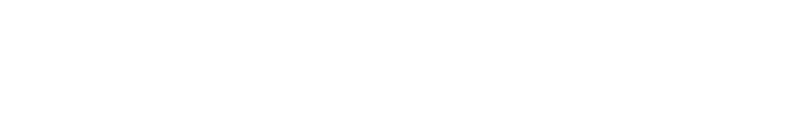
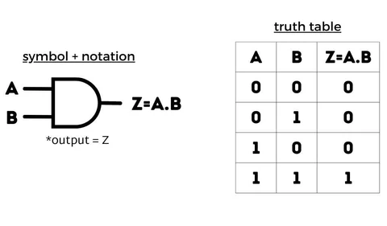
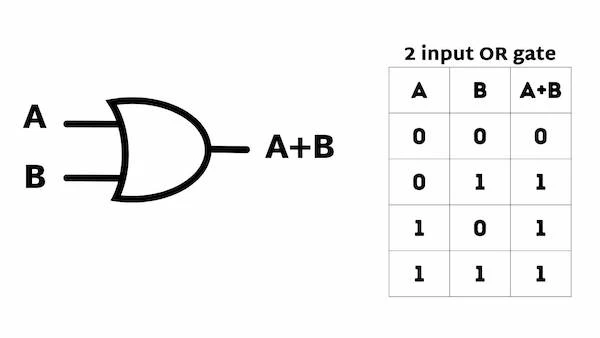
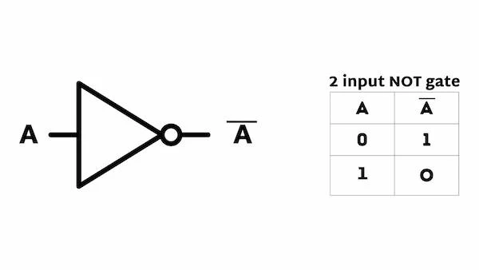
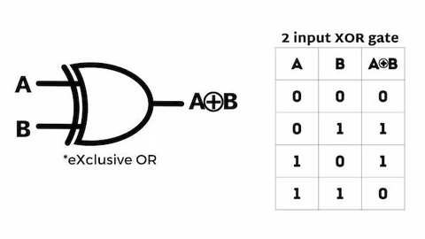
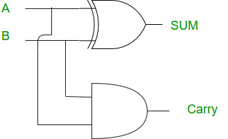
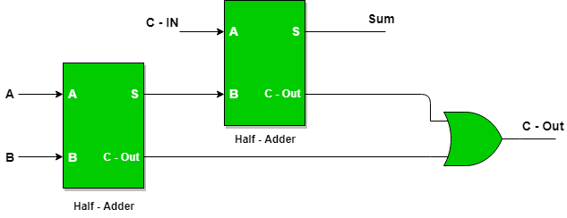
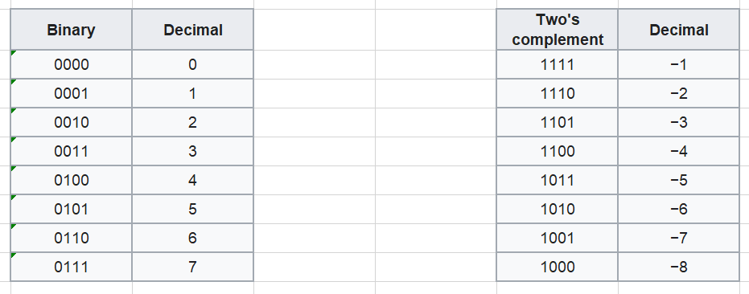

# RISC-V Processor Design 🚀

## Building Tiny Vedas

Marco Spaziani Brunella, PhD
Lecture 2

---
# Agenda

- Digital Systems
- Combinatorial Logic
- Digital Arithmetic
- ALU Design

---

# What is a system?

- For now, it's a black box that transforms **input** signals into **output** signals
- Our job is to design the content of the black box* to obtain the intended **output** from the **input**



> \* In LTV Systems jargon, is called a transfer function

---

# What is a signal?

- A signal is a function that changes over time, mathematically x(t)
- Signals are classified based on the type of values that x(t) can assume
   - Analog: x(t) can assume any value in a continuous range
   - Digital: x(t) can assume only certain values in a discrete set
- Binary signals are a particular subset of digital signals where x(t) can assume only two values: 0 and 1*


> \* We'll see that we have to introduce two more values to deal with multi-driven nets and non-driven nets, **X** and **Z** respectively
---

# Designing digital systems

- We need a language to **describe** what's inside the black box --> **Hardware Description Language (HDL)**
- Regardless of the specific HDL, all HDL have these two components:
  - Input and Output port definition
  - Logic definition (how inputs transform into outputs)
- We'll call it a **module**

---

# System Verilog Module Skeleton

```verilog
module <module_name> (
  <port_list>,
  <port_list>
);

  // Internal signals
  <wires_and_registers>

  // Logic
endmodule
```

---

# Combinatorial Logic - AND Gate

- Logic that has no memory
- Output depends only on the current values of the inputs

```verilog
module and_gate (
  input logic x,
  input logic y,
  output logic z
);

  assign z = x & y; /* AND operation in SV is & */

endmodule
```


---

# Combinatorial Logic - AND Gate



---
# Testing the AND Gate - Our First Testbench

```verilog
`timescale 1ns/1ns
module and_gate_tb;

  logic x, y, z;

  and_gate dut (x, y, z); /* AND gate instantiation */

  initial begin
    x = 0; y = 0; #10; /* Wait 10ns */
    $display("x = %b, y = %b, z = %b", x, y, z); /* Display the values */
    x = 0; y = 1; #10; /* Wait 10ns */
    $display("x = %b, y = %b, z = %b", x, y, z); /* Display the values */
    x = 1; y = 0; #10; /* Wait 10ns */
    $display("x = %b, y = %b, z = %b", x, y, z); /* Display the values */
    x = 1; y = 1; #10; /* Wait 10ns */
    $display("x = %b, y = %b, z = %b", x, y, z); /* Display the values */
    $finish; /* Finish the simulation */
  end
endmodule
```
---

# Testing the AND Gate - Verilator Code 

```c++
#include "Vand_gate_tb.h" /* Transforms the System Verilog module into a C++ module */
#include "verilated_vcd_c.h"
int main(int argc, char **argv, char **env) {
    Verilated::commandArgs(argc, argv);
    Vand_gate_tb* top = new Vand_gate_tb;
    Verilated::traceEverOn(true);
    VerilatedVcdC* tfp = new VerilatedVcdC;
    top->trace(tfp, 99);
    tfp->open("and_gate.vcd");
    printf("****** START of AND GATE TEST ****** \n");
    while (!Verilated::gotFinish()) {
        top->eval();
        tfp->dump(Verilated::time());
        Verilated::timeInc(1);
    }
    tfp->close();
    printf("****** END of AND GATE TEST ****** \n");
    delete top;
    return 0;
}
```

---

# Combinatorial Logic - OR Gate


```verilog
module or_gate (
  input logic x,
  input logic y,
  output logic z
);

  assign z = x | y; /* OR operation in SV is | */

endmodule
```

---

# Combinatorial Logic - OR Gate



---

# Combinatorial Logic - NOT Gate


```verilog
module not_gate (
  input logic x,
  output logic z
);

  assign z = ~x; /* NOT operation in SV is ~ */
endmodule
```

---

# Combinatorial Logic - NOT Gate



---

# Combinatorial Logic - XOR Gate


```verilog
module xor_gate (
  input logic x,
  input logic y,
  output logic z
);

  assign z = x ^ y; /* XOR operation in SV is ^ */

endmodule
```

---

# Combinatorial Logic - XOR Gate



---

# Combinatorial Logic - Bitwise Operations

- I can apply the AND, OR, and XOR operations to multiple bits at once

```verilog
module bitwise_operations (
  input logic [3:0] x,
  input logic [3:0] y,
  output logic [3:0] z_and,
  output logic [3:0] z_or,
  output logic [3:0] z_xor
);

  assign z_and = x & y;
  assign z_or = x | y;
  assign z_xor = x ^ y;

endmodule
```

---

# Digital Arithmetic - Binary Encoding

- We can encode any decimal number (base-10) in binary (base-2)
- d prefix means decimal
- b prefix means binary
- Each binary digit is called a **bit**

d12 = b1100 = 1\*2^3 + 1\*2^2 + 0\*2^1 + 0\*2^0 = 8 + 4 + 0 + 0 = d12
d10 = b1010 = 1\*2^3 + 0\*2^2 + 1\*2^1 + 0\*2^0 = 8 + 0 + 2 + 0 = d10
d7 = b0111 = 0\*2^3 + 1\*2^2 + 1\*2^1 + 1\*2^0 = 0 + 4 + 2 + 1 = d7

---

# Digital Arithmetic - Hexadecimal Encoding

- Hexadecimal (base-16) is a more compact representation of binary
  - Group 4 bits into a **nibble** (nobody uses that term anymore!)
  - Digits can be 0-9 and A-F (10-15)
- h prefix means hexadecimal

d12 = hC = 12\*16^0 = d12
d10 = hA = 10\*16^0 = d10
d7 = h7 = 7\*16^0 = d7

---

# Digital Arithmetic - Half-Adder

- A half-adder is a combinatorial logic circuit that adds two bits
- It has two inputs and two outputs
- The inputs are the two bits to be added
- The outputs are the sum and the carry


```verilog
module half_adder (
  input logic x,
  input logic y,
  output logic sum,
  output logic carry
);

  assign sum = x ^ y;
  assign carry = x & y;

endmodule
```

---

# Digital Arithmetic - Half-Adder



---

# Digital Arithmetic - Full-Adder

- A full-adder is a combinatorial logic circuit that adds two bits and a carry
- It has three inputs and two outputs
- The inputs are the two bits to be added and the carry
- The outputs are the sum and the carry 


---

# Digital Arithmetic - Full-Adder

```verilog
module full_adder (
  input logic x,
  input logic y,
  input logic carry_in,
  output logic sum,
  output logic carry_out
);

  // Internal signals
  logic sum_a, carry_a, sum_b, carry_b;

  // Half-adders
  half_adder ha1 (x, y, sum_a, carry_a);
  half_adder ha2 (sum_a, carry_in, sum, carry_b);

  // Final sum and carry
  assign sum = sum_b;
  assign carry_out = carry_a | carry_b;

endmodule
```

---

# Digital Arithmetic - Full-Adder



---


# Digital Arithmetic - Adding 4-bit Numbers (unsigned)

```verilog
module adder_4bit (
  input logic [3:0] x,
  input logic [3:0] y,
  output logic [4:0] z
  );

  // Internal signals
  logic [3:0] sum;
  logic [3:0] carry;
  
  // Full-adders
  half_adder ha0 (x[0], y[0], sum[0], carry[0]);
  full_adder fa1 (x[1], y[1], carry[0], sum[1], carry[1]);
  full_adder fa2 (x[2], y[2], carry[1], sum[2], carry[2]);
  full_adder fa3 (x[3], y[3], carry[2], sum[3], carry[3]);

  assign z = {carry[3], sum};

endmodule
```

---

# Digital Arithmetic - Adding 4-bit Numbers (unsigned)

- More conveniently

```verilog
module adder_4bit (
  input logic [3:0] x,
  input logic [3:0] y,
  output logic [4:0] z
);

  assign z = unsigned'(x) + unsigned'(y);

endmodule
```

---

# Digital Arithmetic - Overflow


```verilog
module adder_4_bit_overflow (
  input logic [3:0] x,
  input logic [3:0] y,
  output logic [3:0] z,
  output logic overflow
);

  logic [4:0] z_unsigned;

  assign z_unsigned = unsigned'(x) + unsigned'(y);
  assign z = z_unsigned[3:0];
  assign overflow = z_unsigned[4];

endmodule
```

---

# Digital Arithmetic - Handling Signed Numbers

- Signed numbers are encoded using two's complement
- The most significant bit is the sign bit
- The range of signed numbers is from -2^(n-1) to 2^(n-1) - 1
- The range of unsigned numbers is from 0 to 2^n - 1




---

# Digital Arithmetic - Handling Signed Numbers

- The beauty of two's complement is that the addition of signed numbers works the same way as the addition of unsigned numbers
- We can use the same adder module to add signed and unsigned numbers

```verilog
module adder_4_bit_signed (
  input logic [3:0] x,
  input logic [3:0] y,
  output logic [4:0] z
);

  assign z = signed'(x) + signed'(y);

endmodule
```

---

### Digital Arithmetic - Left Shift

- Left shift is a combinatorial logic circuit that shifts a number to the left by a given number of bits
- It has two inputs and one output, equivalent to multiplying by 2^y
- The inputs are the number to be shifted and the number of bits to shift
- The output is the shifted number

```verilog

parameter OPERAND_WIDTH = 4;

module left_shift (
  input logic [OPERAND_WIDTH-1:0] x,
  input logic [$clog2(OPERAND_WIDTH)-1:0] y,
  output logic [OPERAND_WIDTH-1:0] z
);
  assign z = x << y;
endmodule
```

---

### Digital Arithmetic - Logical Right Shift

- Logical right shift is a combinatorial logic circuit that shifts a number to the right by a given number of bits
- It has two inputs and one output
- The inputs are the number to be shifted and the number of bits to shift
- The output is the shifted number

```verilog

parameter OPERAND_WIDTH = 4;

module logical_right_shift (
  input logic [OPERAND_WIDTH-1:0] x,
  input logic [$clog2(OPERAND_WIDTH)-1:0] y,
  output logic [OPERAND_WIDTH-1:0] z
);
  assign z = x >> y;
endmodule
```

---

### Digital Arithmetic - Arithmetic Right Shift

- Arithmetic right shift is a combinatorial logic circuit that shifts a number to the right by a given number of bits
- It has two inputs and one output
- The inputs are the number to be shifted and the number of bits to shift
- The output is the shifted number such that the sign bit is preserved

```verilog

parameter OPERAND_WIDTH = 4;

module arithmetic_right_shift (
  input logic [OPERAND_WIDTH-1:0] x,
  input logic [$clog2(OPERAND_WIDTH)-1:0] y,
  output logic [OPERAND_WIDTH-1:0] z
);
  assign z = $signed(x) >>> y;
endmodule
```

---

# Building the ALU for Tiny Vedas

- Tiny Vedas is a RISC-V RV32IM processor
  - RV --> RISC-V
  - 32 --> 32-bit architecture
  - I --> Integer instructions
  - M --> Integer multiplication and division

- The Arithmetic Logic Unit (ALU) is the unit that performs the arithmetic and logic operations
- It is a combinational logic circuit that takes two operands and an operation code, and produces a result

---

# RISC-V ALU Operations

- Complete list of RISC-V operations are available [here](https://drive.google.com/file/d/1uviu1nH-tScFfgrovvFCrj7Omv8tFtkp/view)
- Or [here](https://www.cl.cam.ac.uk/teaching/1617/ECAD+Arch/files/docs/RISCVGreenCardv8-20151013.pdf) for quick and dirty reference
- Our ALU will support the following operations:
  - Arithmetic: add, subtract
  - Logic: and, or, xor
  - Shifts: shift left, shift right
  - Comparisons: less than, equal, not equal

---

# ALU Design

- Two 32-bit inputs: src1 and src2
- One 32-bit output: result
- One 4-bit opcode: alu_op (need to support ~10 ops, so ceil(log2(10)) = 4 bits)

---

# ALU Design

- Let's define and enum for the operations

```verilog
enum logic [3:0] {
  ALU_ADD, /* Encoded as 0000 */
  ALU_SUB, /* Encoded as 0001 */
  ALU_AND, /* Encoded as 0010 */
  ALU_OR, /* Encoded as 0011 */
  ALU_XOR, /* Encoded as 0100 */
  ALU_SLL, /* Encoded as 0101 */
  ALU_SRL, /* Encoded as 0110 */
  ALU_SRA, /* Encoded as 0111 */
  ALU_SLT, /* Encoded as 1000 */
  ALU_SLTU, /* Encoded as 1001 */
  ALU_XNOR /* Encoded as 1010 */
} alu_op_t;
```

---

# ALU Design

- Let's define the module

```verilog
module alu (
  input logic [31:0] src1,
  input logic [31:0] src2,
  input alu_op_t alu_op,
  output logic [31:0] result
);

<logic_goes_here>

endmodule
```

---

# ALU Design

- Let's add the logic

```verilog

casez (alu_op)
  ALU_ADD: result = $signed(src1) + $signed(src2);
  ALU_SUB: result = $signed(src1) - $signed(src2);
  ALU_AND: result = src1 & src2;
  ALU_OR: result = src1 | src2;
  ALU_XOR: result = src1 ^ src2;
  ALU_SLL: result = src1 << src2;
  ALU_SRL: result = src1 >> src2;
  ALU_SRA: result = $signed(src1) >>> src2;
  ALU_SLT: result = $signed(src1) < $signed(src2);
  ALU_SLTU: result = src1 < src2;
  ALU_XNOR: result = ~(src1 ^ src2);
  default: result = 32'b0;
endcase
```

---

# Logic Datatype

- Logic is a datatype that can be used to represent a single bit or a vector of bits
- A signle logic bit can assume four values:
  - 0
  - 1
  - X (unknown) --> multiple drivers driving different values
  - Z (high-impedance) --> no driver
- Verilator is a two-state simulator, so it doesn't support X and Z values
  - How we deal with potential bugs due to X and Z in verilator if it doesn't support it?
  - We randomize the inputs, error will eventually bubble up at the outputs


