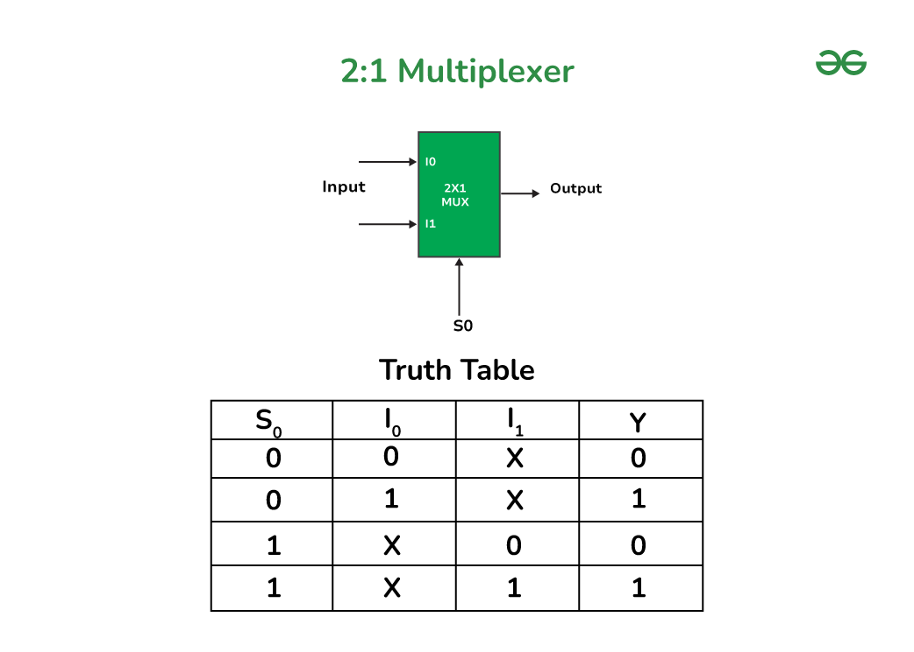

# RISC-V Processor Design 🚀

## Building Tiny Vedas

Marco Spaziani Brunella, PhD
Lecture 3

---

# Agenda

- Combinatorial Logic: Multiplexers
- Sequential Logic: Latches and Flip-Flops
- Register Transfer Level Design
- Register Files
- Memory

---

# Multiplexers

- We already saw a multiplexer in the previous lecture: the case statement in the ALU
- We now formalize the concept of multiplexer

A multiplexer is a combinatorial logic circuit that selects one of several input signals and routes it to a single output line based on the value of the select lines.

---

# Multiplexers



---

# Multiplexers Coding: Ternary Operator

```verilog
module mux2to1(
    input  logic [31:0] i0,
    input  logic [31:0] i1,
    input  logic       s0,
    output logic [31:0] out
);

assign out = s0 ? i1 : i0;

endmodule
```

Handy if you have a simple condition to evaluate. Becomes a spaghetti mess if you have more than two inputs.

---

# Multiplexers Coding: OR of ANDs

```verilog
module mux2to1(
    input  logic [31:0] i0,
    input  logic [31:0] i1,
    input  logic       s0,
    output logic [31:0] out
);

assign out = ({32{s0}} & i1) | ({32{~s0}} & i0);

endmodule
```

Allows for more complex conditions to be evaluated. May not be recognized as a multiplexer by some synthesis tools.

---

# Multiplexers Coding: Case Statement

```verilog
module mux2to1(
    input  logic [31:0] i0,
    input  logic [31:0] i1,
    input  logic       s0,
    output logic [31:0] out
);

always_comb begin
    case (s0)
        1'b0: out = i0;
        1'b1: out = i1;
        default: out = 32'b0;
    endcase
end

endmodule
```

Allows for the most complex conditions to be evaluated. Synthesis tools will recognize this as a multiplexer.

---

# Case, Casez, and Casex

- `case` is the most basic form of a multiplexer
- `casez` is a variant that allows for don't care conditions --> e.g. priority encoder
- `casex`, DO NOT USE IT, is a variant that allows for don't care conditions and don't care values --> X propagates

---

# Unique Case

- A qualifier for a case statement that allows for unique selection of the case

```verilog
case (condition)
    unique case (condition)
        ...
    endcase
endcase
```

If two conditions are true, simulator throws an error/warning. Instructs the synthesis tool that only one case will be true at any given time, so it can evaluate the cases in parallel.

---

# Sequential Logic

- Sequential logic is a type of logic that depends on the past and present values of the inputs to determine the present output
- It is characterized by the presence of latches and flip-flops

---

# Latches and Flip-Flops

- Latches are **combinatorial logic** circuits that store the value of the input signal
- Flip-flops are **sequential logic** circuits that store the value of the input signal

---

# Set-Reset Latch

- A set-reset latch is a combinatorial logic circuit that stores the value of the input signal
- It is characterized by the presence of a set and reset input


---

# Why Latches are bad?

- Latches are bad because they can cause **hazards**
- A hazard is a situation where the output of a circuit is not determined by the current inputs
- This can cause the circuit to malfunction
- You should never intentionally put latches in your design

---

# Latch Inferring

- Synthesis tools will infer latches if they detect a combinatorial loop (combo loop in jargon)
- Or if you forgot a signal from the sensitivity list in an always block (always_comb or always_ff avoid this)
- Or if you use a blocking assignment in a procedural block --> more on this later

---

# Latch Inference: Combo loop

```verilog
always_comb begin
    out = in1 & in2;
    out = in3 | out;
end
```

This will infer a latch for `out` because the synthesis tool will detect a combinatorial loop.

---

# Latch Inference: Forgetting a signal in the sensitivity list

```verilog
always @(a, b) begin
    out = a & b & c;
end
```

This will infer a latch for `out` because the synthesis tool will detect that `c` is not in the sensitivity list. When `c` changes, `out` will not be updated.

---

# Sequential Logic: Clock and Reset

- Clock and reset are two signals that are used to synchronize the circuit
- Clock is used to synchronize the circuit
- Reset is used to initialize the circuit

---

# Clock Signal

- Clock signal is a signal that is used to synchronize the circuit
- It is a square wave signal that oscillates between 0 and 1


---

# Clock Signal Characteristics

- Clock signal has a period and a duty cycle
- Period is the time it takes to complete one cycle
  - The inverse of the period is the frequency, measured in Hertz (Hz)
- Duty cycle is the percentage of the period that the signal is high

---

# What makes the clock signal special?

- Fastest signal you can have in your design
  - We'll see that all signals are clocked, meaning they change at the rising (or falling) edge of the clock signal
  - This means that the fastest, non-clock signal has half the frequency of the clock signal
- Distributing the clock signal through the design is the most challenging part of chip design

- We don't care here as we're just focusing on architecture and simulation, but we will cover all the best coding practices in the lab

---

# Reset Signal

- Reset signal is a signal that is used to initialize the circuit
- It brings the circuit to a known state
- Typically provided externally and later synchronized to the clock signal

---

# D Flip-Flop (without reset)

- D Flip-Flop is a sequential logic circuit that stores the value of the input signal
- It is characterized by the presence of a clock signal


---

# D Flip-Flop Architecture


---

# D Flip-Flop Coding

```verilog
module d_ff(
    input  logic clk,
    input  logic d,
    output logic q
);

always_ff @(posedge clk) begin
    q <= d; // Note the use of <= for sequential logic
end

endmodule
```

---

# Blocking vs Non-Blocking Assignments

- Blocking assignments are used for combinatorial logic
- Non-blocking assignments are used for sequential logic

```verilog
always_ff @(posedge clk) begin
    q <= d; // Non-blocking assignment
    q = d; // Blocking assignment WRONG
end
```

---

# D Flip-Flop with Synchronous Reset

```verilog
module dff_sync_reset(
    input  logic clk,
    input  logic rst_n,
    input  logic d,
    output logic q
);

always_ff @(posedge clk) begin
    if (!rst_n) begin
        q <= 0;
    end else begin
        q <= d;
    end
end
```

---

# D Flip-Flop with Asynchronous Reset

- D Flip-Flop with asynchronous reset is a sequential logic circuit that stores the value of the input signal
- It is characterized by the presence of a reset signal

```verilog
module dff_async_reset(
    input  logic clk,
    input  logic rst_n,
    input  logic d,
    output logic q
);

always_ff @(posedge clk or negedge rst_n) begin
    if (!rst_n) begin
        q <= 0;
    end else begin
        q <= d;
    end
end
```

---

# Which one should you use?

- Depend on the platform where your circuit will be implemented

  - For FPGAs, consult the documentation of the FPGA vendor
  - For ASICs, consult the Process Design Kit (PDK) of the foundry you are using

- We will use synchronous reset in this course, since we assume that the reset has been properly synchronized to the clock signal before entering the design

---

# D Flip-Flop With Reset and Enable

```verilog
module d_ff_sync_reset_en(
    input  logic clk,
    input  logic rst_n,
    input  logic en,
    input  logic d,
    output logic q
);

always_ff @(posedge clk) begin
    if (!rst_n) begin
        q <= 0;
    end else if (en) begin
        q <= d;
    end
end
```

---

# Register

- Bank of D Flip-Flops

---

# Register with no reset

```verilog
module register_sync_reset_en #(parameter integer WIDTH = 32)(
    input  logic clk,
    input  logic [WIDTH-1:0] d,
    output logic [WIDTH-1:0] q
);

always_ff @(posedge clk) begin
    q <= d;
end

endmodule
```

---

# Register with reset

```verilog
module register_sync_reset #(parameter integer WIDTH = 32)(
    input  logic clk,
    input  logic rst_n,
    input  logic [WIDTH-1:0] d,
    output logic [WIDTH-1:0] q
);

always_ff @(posedge clk) begin
    if (!rst_n) begin
        q <= 0;
    end else begin
        q <= d;
    end
end

endmodule
```

---

# Register with reset and enable

```verilog
module register_sync_reset_en #(parameter integer WIDTH = 32)(
    input  logic clk,
    input  logic rst_n,
    input  logic en,
    input  logic [WIDTH-1:0] d,
    output logic [WIDTH-1:0] q
);

always_ff @(posedge clk) begin
    if (!rst_n) begin
        q <= 0;
    end else if (en) begin
        q <= d;
    end
end

endmodule
```

---

# Register Transfer Level Design

- Register Transfer Level (RTL) design is a design style that focuses on the transfer of data between registers
- Combinatorial logic is used to transfer data between registers
- Sequential logic is used to store the data

---

# Register File

```verilog
module register_file #(parameter integer WIDTH = 32, parameter integer N = 4)(
    input  logic clk,
    input  logic rst_n,
    input  logic [$clog2(N)-1:0] read_addr,
    input  logic [$clog2(N)-1:0] write_addr,
    input  logic write_en,
    input  logic [WIDTH-1:0] data_in,
    output logic [WIDTH-1:0] data_out
);

logic [WIDTH-1:0] registers [N];

always_ff @(posedge clk) begin
    if (!rst_n) begin
        for (int i = 0; i < N; i++) begin
            registers[i] <= 0;
        end
    end else if (write_en) begin
        registers[write_addr] <= data_in;
    end
end

assign data_out = registers[read_addr];

endmodule
```

---

# Register File with Read and Write Ports

```verilog
module register_file #(parameter integer WIDTH = 32, 
                       parameter integer N = 4, 
                       parameter integer N_READ_PORTS = 2, 
                       parameter integer N_WRITE_PORTS = 1)(
    input  logic clk,
    input  logic rst_n,
    input  logic [N_READ_PORTS-1:0] read_en,
    input  logic [N_WRITE_PORTS-1:0] write_en,
    input  logic [$clog2(N)-1:0] read_addr [N_READ_PORTS],
    input  logic [$clog2(N)-1:0] write_addr [N_WRITE_PORTS],
    input  logic [WIDTH-1:0] data_in [N_WRITE_PORTS],
    output logic [WIDTH-1:0] data_out [N_READ_PORTS]
);

logic [WIDTH-1:0] registers [N];

always_ff @(posedge clk) begin
    if (!rst_n) begin
        for (int i = 0; i < N; i++) begin
            registers[i] <= 0;
        end
        for (int i = 0; i < N_WRITE_PORTS; i++) begin
            if (write_en[i]) begin
                registers[write_addr[i]] <= data_in[i];
            end
        end
    end
end

always_comb begin
    for (int i = 0; i < N_READ_PORTS; i++) begin
        if (read_en[i]) begin
            data_out[i] = registers[read_addr[i]];
        end
    end
end

endmodule
```

---

# Memory

- Many types of memories, here we will focus on Static RAM memories, since are typically present in FPGAs and modern PDKs have some sort of SRAM Memory compilers available.

- We will not enter into the details of how to compile SRAM memories into the final netlist, but the idea is that the SRAM memory is synthesized into a block of logic that implements the memory.

---

# Memory VS Register File

- The main difference between SRAM memory and a register file is the underlying implementation (flip-flops vs SRAM cell)
- A register file as a combinatorial read port and a sequential write port
- A memory has a sequential read port and a sequential write port
- Memory is harder to reset

---

# Memory Coding

```verilog
module memory #(parameter integer WIDTH = 32, parameter integer N = 4)(
    input  logic clk,
    input  logic [WIDTH-1:0] data_in,
    input  logic [$clog2(N)-1:0] addr,
    input  logic write_en,
    output logic [WIDTH-1:0] data_out);

logic [WIDTH-1:0] memory [N];

always_ff @(posedge clk) begin
    if (write_en) begin
        memory[addr] <= data_in;
    end
    data_out <= memory[addr];
end
```

---

# Memory with Read and Write Ports

```verilog
module memory #(parameter integer WIDTH = 32, 
               parameter integer N = 4, 
               parameter integer N_READ_PORTS = 2, 
               parameter integer N_WRITE_PORTS = 1)(
    input  logic clk,
    input  logic [N_READ_PORTS-1:0] read_en,
    input  logic [N_WRITE_PORTS-1:0] write_en,
    input  logic [$clog2(N)-1:0] read_addr [N_READ_PORTS],
    input  logic [$clog2(N)-1:0] write_addr [N_WRITE_PORTS],
    input  logic [WIDTH-1:0] data_in [N_WRITE_PORTS],
    output logic [WIDTH-1:0] data_out [N_READ_PORTS]);

logic [WIDTH-1:0] memory [N];

always_ff @(posedge clk) begin
    for (int i = 0; i < N_WRITE_PORTS; i++) begin
        if (write_en[i]) begin
            memory[write_addr[i]] <= data_in[i];
        end
    end
    for (int i = 0; i < N_READ_PORTS; i++) begin
        if (read_en[i]) begin
            data_out[i] = memory[read_addr[i]];
        end
    end
end

endmodule
```
