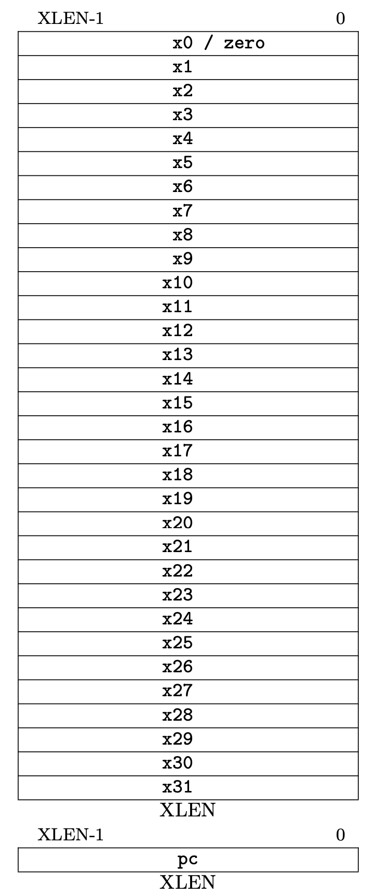
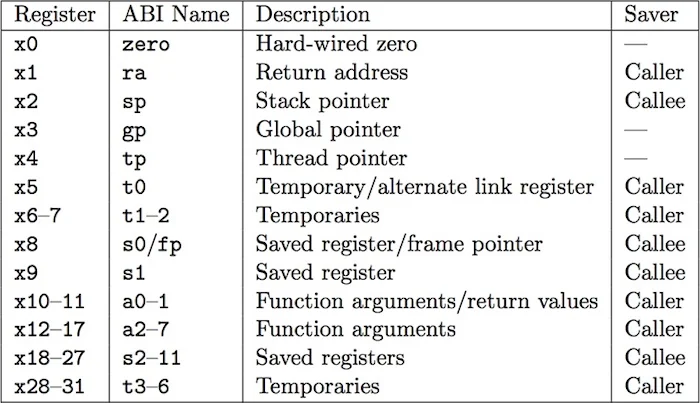
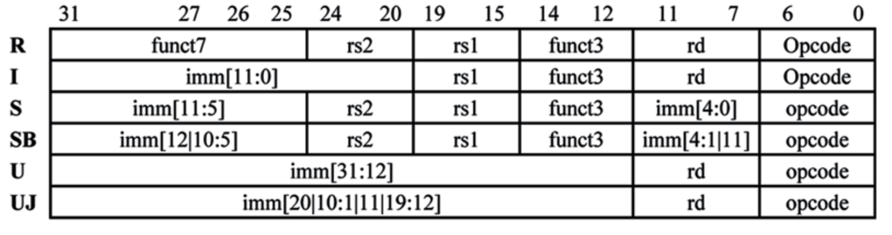
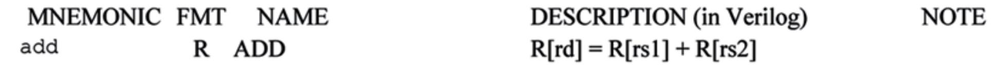
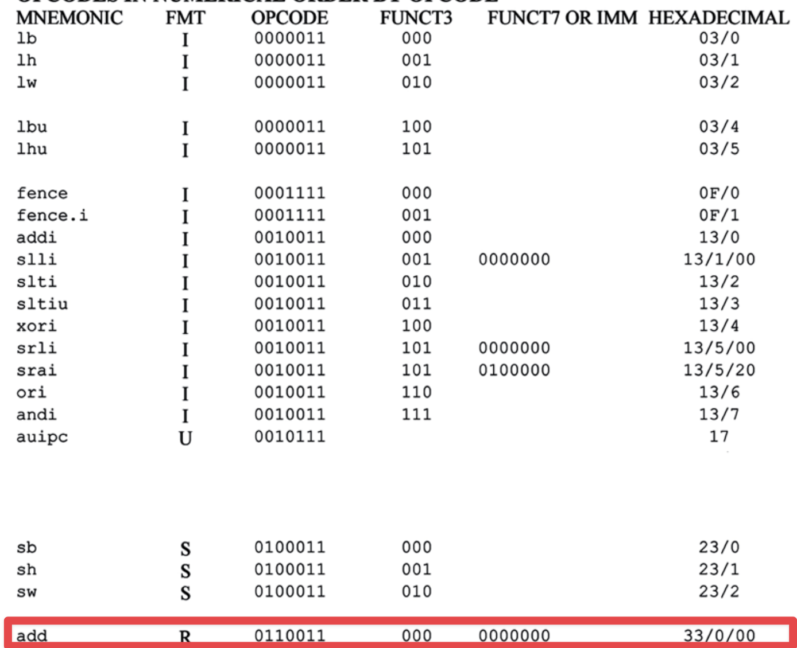
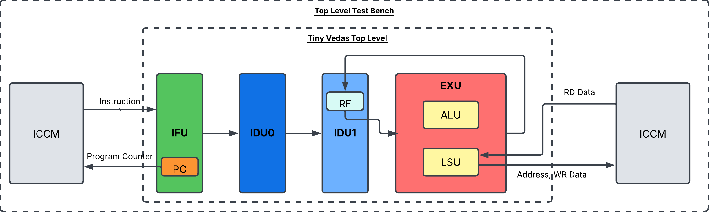
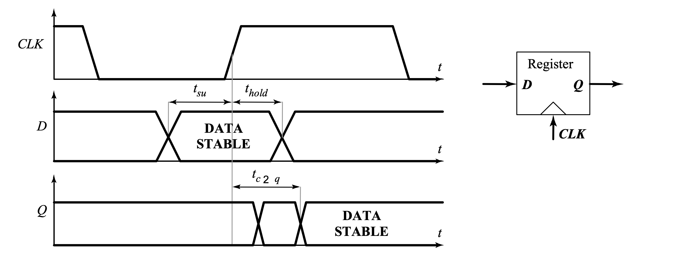
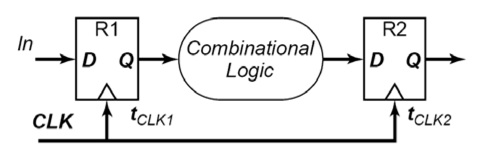
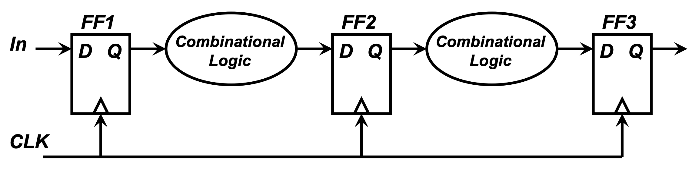
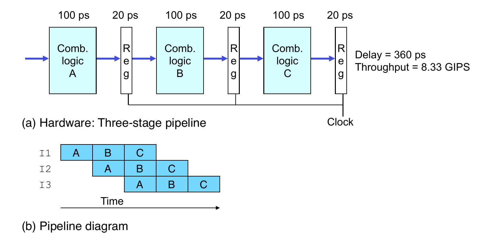

# RISC-V Processor Design 🚀

## Building Tiny Vedas

Marco Spaziani Brunella, PhD
Lecture 4

---

# Agenda

- RISC-V RV32IM Instruction Set Architecture 
- Tiny Vedas Architecture
    - Arch Specs
    - Arch Diagram
- Single Cycle CPU
- Timing Issues
- Pipelining
- Instruction Fetch Unit

---

# RV32IM ISA

- Divided into Unpriviledged and Priviledged
- We'll focus on the unpriviledged for now
- You can find the latest ISA Spec [here](https://lf-riscv.atlassian.net/wiki/spaces/HOME/pages/16154769/RISC-V+Technical+Specifications)

---

# RV32 Register File

- This is where we'll store our **microarchitectural** state
- XLEN = 32b (this is what RV32 means)
- 32 x XLEN general purpose registers
    - Named x0-x31
    - Catch: x0 is tied to 0 (we'll see later why)
   
---

# Application Binary Interface (ABI)

- The customer of any ISA is the compiler (most of the time)
- The ABI defines how registers should be used by the compiler

    

---
# RV32 Program Counter

- Is the register that holds the memory address of the next instruction to be executed
- It's an XLEN = 32b register as well
- We'll se what kind of operation we must be able to perform on this register on the next lecture

---
# Instruction Encoding

- Instructions are enoded into 32b words
    - Has NOTHING to do with the fact that this is RV32
    - We have 32b instructions
- Extremely Regular Instruction Encoding -> Easy decode tables
    

---

# R-Type Instruction Example

---

# R-Type Instruction Example

---

# Architecture Spec (very loose)

- We assume our processor will handle one instruction at a time
    - We'll see what this means in the context of pipelining
- Each instruction has at most 2 source operands and 1 destination operand
    - 2 read ports on the register file
    - 1 write port in the register file

---

# Architecture Spec

- We'll logically partition the design into four stages
    - Instruction Fetch Unit (IFU) -> Get the Instruction to execute
    - Instruction Decode Unit #0 (IDU) -> Understand what the instruction does and ask for the operands
    - Instruction Decode Unit #1 (IDU) -> Get the operands
    - Instruction Execute Unit (EXU) -> Execute it and commit the results to the microarchitectural state

---

# Architecture Spec

- Where do we get the instructions?
    - The Program Counter (PC) assumes a byte-addressable, word-aligned Instruction Memory
    - We'll call it Instruction Closely Coupled Memory (ICCM)
    - Access latency is 1 Clock Cycle (CC)
    - We'll see how to initialize this ICCM in our top-level SystemVerilog testench
---

# Architecture Spec

- What about the Data Memory?
    - We will assume a byte-addressable, word-aligned (we'll see how this is going to cause some interesting issues) Data Memory
    - We'll call it Data Closely Coupled Instruction Memory (DCCM)
    - Access Latency is 1 Clock Cycle (CC)

---

# Architecture Diagram (not all paths shown)

---

# Single Cycle CPU (tought experiment)

- IFU Unit gets the first instruction from ICCM (clocked)
- IDU #0 gets the instruction and decodes it
- IDU #1 gets the operands from the register file (read is unclocked, remember?)
- EXU executes the instruction and writes the result to the register file (clocked)
- The whole operation happens in 1 clock cycle
- Performance depends on how high can we drive the clock frequency
  - How fast can we go?
---

# Timing Characteristics of Flops/Registers

- Setup time (tsu) is the time that data (D) must be valid before clock transition
- Hold time (th) is the time that data (D) must be valid after clock transition
- Propagation delay (tC2Q) is the delay time that the data (D) is copied to output (Q) with reference to clock edge

---

# Timing Constraints

- Setup time violation:
    - If the signal takes too long to propagate, the next flop may sample the signal too late
- The clock period (inverse of the frequency) must give enough time for
  - The first flop to "launch" the signal tC2Q
  - The signal to propagate through the combinational logic tlogic
  - The second flop to sample the signal with enough time to meet the setup time tsu

---

# Single Cycle CPU -> Not Happening

- Clock period must be greater than the maximum of T >= tC2Q + tlogic + tsu
- This is called the **timing closure** problem
- A single Cycle CPU would be dominated by tlogic
- We cannot make the logic arbitrarly faster
  - We need to break it down!

---

# Pipelining

- We can break down the combinatorial logic into smaller, faster blocks
- Ideally, if we introduce N pipeline stages and we balance it perfectly, we can run at a clock frequency of N times the original clock frequency
- This is called the **Amdahl's Law**

---

# Pipelining

- In this new scheme, each CPU stage has its own output register
- Seemingly, we increased the latency of an instruction going in
   - In the single cycle case, we had a latency of 1 clock cycle
   - Now, we have a latency of N clock cycles
   - This is not the case!

---

# Pipelining

- We can now overlap the operations of different instructions
- While an operation is in EXU, the IDU can be decoding the next instruction
- And the IFU can be fetching the next instruction
- Once the pipeline is full, we still have one instruction coming out per clock cycle, but at N times the frequency!

---

# Pipelining

---

# Pipelining Issues

- Data Hazards
- Control Hazards
- Structural Hazards

We're going to deal with all of those in the coming lectures

---

# Instruction Fetch Unit

- Generates the PC
- Gets the instruction from ICCM
- Updates the PC