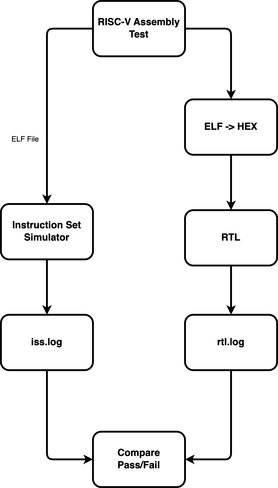

# RISC-V Processor Design 🚀

## Building Tiny Vedas

Marco Spaziani Brunella, PhD
Lecture 6

---

# Agenda

- Instruction Execute
- Compiling a program
- Instruction Set Simulator (ISS)
- Simulation Manager
- Bug Fixing

---

# Instruction Execute

- For now, just ALU
- 1 clock cycle delay
- Then straight to the register file

---

# Compiling a program for RISC-V

- We'll use GNU RISC-V toolchain
- There's also LLVM toolchain, but we'll stick to GNU

---

# Instruction Set Simulator (ISS)

- To my surprise, the only hardware-ready, open-source ISS got deprecated
- So I had to build a custom one (not open-source, might sell it in the future)
- Executable is in the `tools` folder

---

# Putting it all together --> Simulation Manager

---

# What's next?

- Running regression tests
   - Smoke test list that runs at each commit
   - Ideally, set-up a CI/CD pipeline
   - Plan to do a bonus lecture about it

