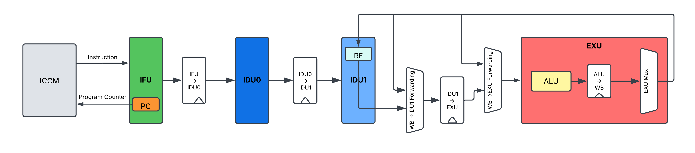

# RISC-V Processor Design 🚀

## Building Tiny Vedas

Marco Spaziani Brunella, PhD
Lecture 7

---

# Agenda

- Data Hazards
- Operand Forwarding

---

# Data Hazards

- Theory is extremely rich here, as the human urge to categorize things is overwhelming
- We'll focus on the practical side of things
- For us, Data Hazard = Read-After-Write (RAW) hazard = True Dependency
- We'll see how to solve it with Operand Forwarding

---

# What is Read-After-Write (RAW) hazard?

- An instruction comes into our pipeline, with destination register `rd`
- Another instruction comes right after, with source register `rd`
- What value does the second instruction read from `rd`?

```
I1: add x3, x2, x1
I2: add x4, x3, x2
```

---

# Pipeline Perspective

```
T0: I1 enters IDU1 stage (operand read), I2 enters IDU0 stage
T1: I1 enters EX stage, I2 enters IDU1 stage (operand read) --> ISSUE!!!
```

I2 reads the old value of x3, since I1 hasn't written to it yet!

---

# Fixing R-A-W: Bubbles (boring)

```
I1: add x3, x2, x1
I2: nop (bubble)
I3: nop (bubble)
I4: add x4, x3, x2
```

---

# Pipeline Perspective

```
T0: I1 enters IDU1 stage, I4 still out there in imem
T1: I1 enters EX stage, I4 enters IFU
T2: I1 enters WB, I4 enters IDU0 stage
T3: I1 completes WB, I4 enters IDU1 stage (gets the correct value)
```
---

# Fixing R-A-W: Operand Forwarding

- We lost two clock cycles to fix this hazard
- Can we do better?
- Why wait for I1 to complete WB to use its result?

---

# Fixing R-A-W: Operand Forwarding

- In IDU1, before sending the operands to the ALU, check if the destination register of the instruction in EXU1 matches any source register of the instruction in IDU1
- If so, forward the result of EXU to IDU1

---

# Still an issue though

```
I1: add x3, x2, x1
I2: nop
I3: add x5, x3, x3
```

- Same thing, I need to add operand forwarding before going to the IDU1 output flop.

---

# Data Hazards: Summary

- Data Hazards are caused by dependencies between instructions
- We can fix them with:
  - Bubbles --> Compiler task, tipically used in DSPs/VLIWs architectures (I have an entire course on this)
  - Pipeline stalls --> More complex cases, we'll see with MUL and DIV ops
  - Operand forwarding --> For simple cases like the ALU

---

# Current Pipeline




