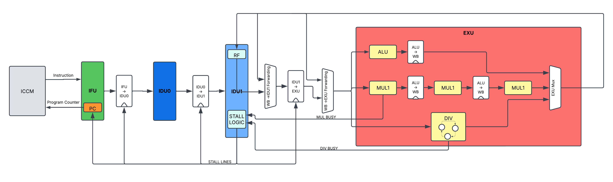

# RISC-V Processor Design 🚀

## Building Tiny Vedas

Marco Spaziani Brunella, PhD
Lecture 8

---

# Agenda

- Multiplier
- Pipeline Stalls
- Divider

---

# Multiplier

- Combinatorial units that takes two operands and produces a result
- If the operands are XLEN, the result is 2XLEN
  - This is why we have lower and upper halves of the result in RV Instructions

---

# Multiplier

- Reality of multipliers is extremely complex
  - Booth Encoding + Wallace Tree/Dadda Tree (for more advanced courses, link in the description)
- We will implement a simple one that respects a the real latency of a multiplier
  - Three cycles latency, fully pipelined

---

# Pipeline Stalls

- Even when this simple multiplier, we need to stall the pipeline
- Suppose this sequence of instructions:

```
mul x1, x2, x3
add x4, x5, x6
```

- The first instruction will take 3 cycles to complete
- The second instruction will start only after the first one has finished
- We need to stall the pipeline of the second instruction until the first one has finished, otherwise we execute on commit out of order
- Nothing bad with executing out of order, but commit should be ALWAYS in order

---

# Pipeline Stalls

- Consider this other sequence of instrucitons:

```
mul x1, x2, x3
mul x7, x5, x6
```

- Here, we don't want to stall since the unit is fully pipelined and we can send the two instructions in

---

# Pipeline Stalls

- Consider this other sequence of instrucitons:

```
mul x1, x2, x3
mul x4, x1, x6
```

- Here, there's a true dependency between the two instructions
- We need to stall the second instruction until the first one has finished
- Otherwise, we will have a data hazard

---

# Pipeline Stalls for Multiplier

- We need to stall in two cases:
  1. When the first instruction is a multiply and the second one is not
  2. When the first instruction is a multiply and the second one is a multiply and theres a RAW dependency

---

# Divider

- Divider is one of the slowest units you can find in a processor
- Iterative Non-restoring algorithm, 1 quotient bit per cycle --> state machine
- Non-deterministic latency, worst case takes 32 cycles
- I've added a short circuit for the following cases:
  - Divide by zero
  - Divide by one
  - Small Numbers look up table
- All the short circuit close in 1 cycle
  
---

# Divider Stalls

- There's no way around here, we always need to stall the pipeline until the divider has finished

---

# Divider Architectures

- There's a lot of ways to implement a divider
  - SRT Divider (base-2, base-4, base-8)
  - Newton-Raphson Divider
  - Goldschmidt Divider
- Want to know more? Check out the courses in the link in the description

---

# New Pipeline Architecture



---